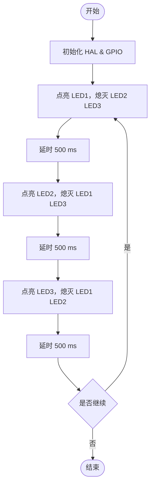

# 嵌入式系统原理与应用实验报告

专业班级：计2307班                                 
组员：许洋帆（235150732）姚志昊（235150734）

实验日期：2025年10月21日

## 实验一：裸机开发环境与GPIO实验


#### 一、实验目的

1. 	初步学会使用STM32CubeMX配置外设工作模式和创建裸机工程；
2. 初步学会使用Keil IDE环境便携代码和调试工程；
3. 掌握使用HAL库GPIO。
4. 修改代码，使三个灯轮流闪烁。


#### 二、实验内容

		1.	使用STM32CubeMX配置生成裸机工程
		2.	kei环境使用


#### 三、实验过程

1. 电路图及说明
   


　　说明：板子上的绿灯、蓝灯和红灯分别连接到的芯片上的PB0、PB14、PB7引脚，均为高电平点亮
　　2. 基本原理
　　通过代码使得开发版上PB0、PB14、PB7引脚的电平通过一定频率变化，使得蓝绿红三种灯可以轮流闪烁


#### 四、编程

1. 程序流程图




2. 实验过程寄存器变化截图及解释（仅实验一）


截图时 GPIOB 的 MODER 已将 PB5/PB6/PB7 配置为通用输出，ODR 对应位为 0，故三灯均灭；
单步运行 HAL_GPIO_WritePin() 后，ODR 相应位翻转，即可观察到寄存器位变化与 LED 亮灭严格对应。

3. 主要代码段及解释

  
 初始化代码解释在注释里
 
   ```c
 static void MX_GPIO_Init(void)
{
  GPIO_InitTypeDef GPIO_InitStruct = {0};

  /* GPIO Ports Clock Enable */
  __HAL_RCC_GPIOB_CLK_ENABLE();
  __HAL_RCC_GPIOA_CLK_ENABLE();

  /*Configure GPIO pin Output Level */
  HAL_GPIO_WritePin(GPIOB, LD0_Pin|LD1_Pin|LD2_Pin, GPIO_PIN_RESET);

  /*Configure GPIO pins : LD0_Pin LD1_Pin LD2_Pin */
  GPIO_InitStruct.Pin   = LD0_Pin|LD1_Pin|LD2_Pin;
  GPIO_InitStruct.Mode  = GPIO_MODE_OUTPUT_PP;
  GPIO_InitStruct.Pull  = GPIO_NOPULL;
  GPIO_InitStruct.Speed = GPIO_SPEED_FREQ_LOW;
  HAL_GPIO_Init(GPIOB, &GPIO_InitStruct);
}
   ```

   功能实现部分代码解释在注释当中：

   ```c


  while (1)
  {
    /* USER CODE END WHILE */

    /* USER CODE BEGIN 3 */
	HAL_GPIO_WritePin(GPIOB, LD0_Pin, GPIO_PIN_SET);
	HAL_Delay(1000);
	HAL_GPIO_WritePin(GPIOB, LD0_Pin, GPIO_PIN_RESET);
	HAL_Delay(1000);
	HAL_GPIO_WritePin(GPIOB, LD1_Pin, GPIO_PIN_SET);
	HAL_Delay(1000);
	HAL_GPIO_WritePin(GPIOB, LD1_Pin, GPIO_PIN_RESET);
	HAL_Delay(1000);
	HAL_GPIO_WritePin(GPIOB, LD2_Pin, GPIO_PIN_SET);
	HAL_Delay(1000);
	HAL_GPIO_WritePin(GPIOB, LD2_Pin, GPIO_PIN_RESET);
	HAL_Delay(1000);
  }
  /* USER CODE END 3 */
}

   ```


#### 五、实验小结

成功配置 GPIOB 口 LD0/LD1/LD2 三个引脚为推挽输出模式。
在 while(1) 用户代码区实现**“轮流亮灭”**逻辑：
LD0 → 灭 → LD1 → 灭 → LD2 → 灭 → 循环；每个状态持续 500 ms，现象清晰。
使用 HAL_GPIO_WritePin 单灯控制，一条语句对应一个灯，便于后续扩展与调试。
掌握了 FinSH 的基本用法：list_thread、help 等命令可实时查看系统线程状态，验证任务运行。
学会用 GET_PIN + pin_mode/write 实现 LED 闪烁，完成简单 I/O 控制。


